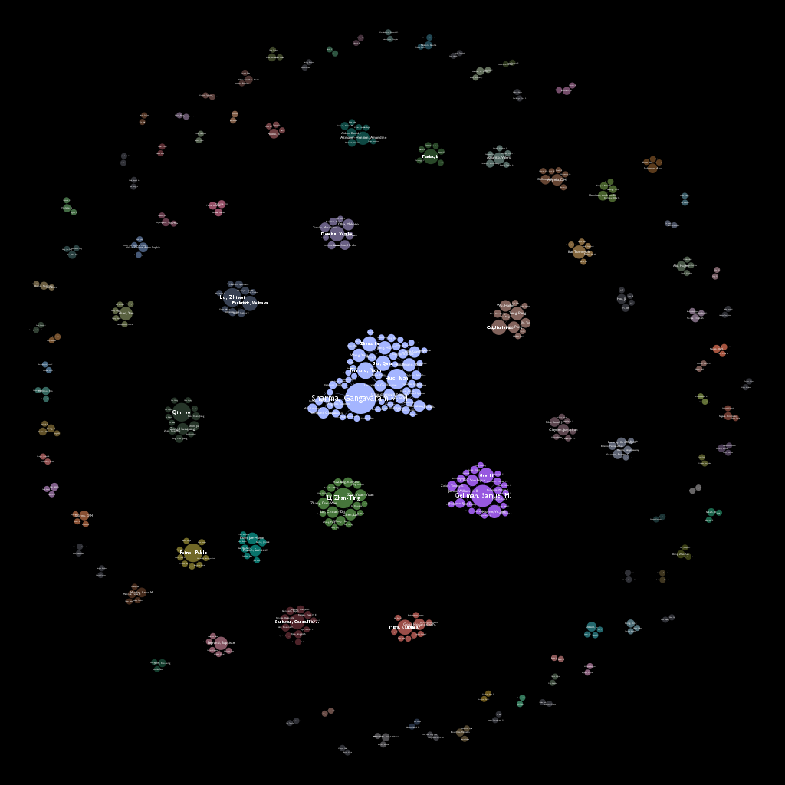
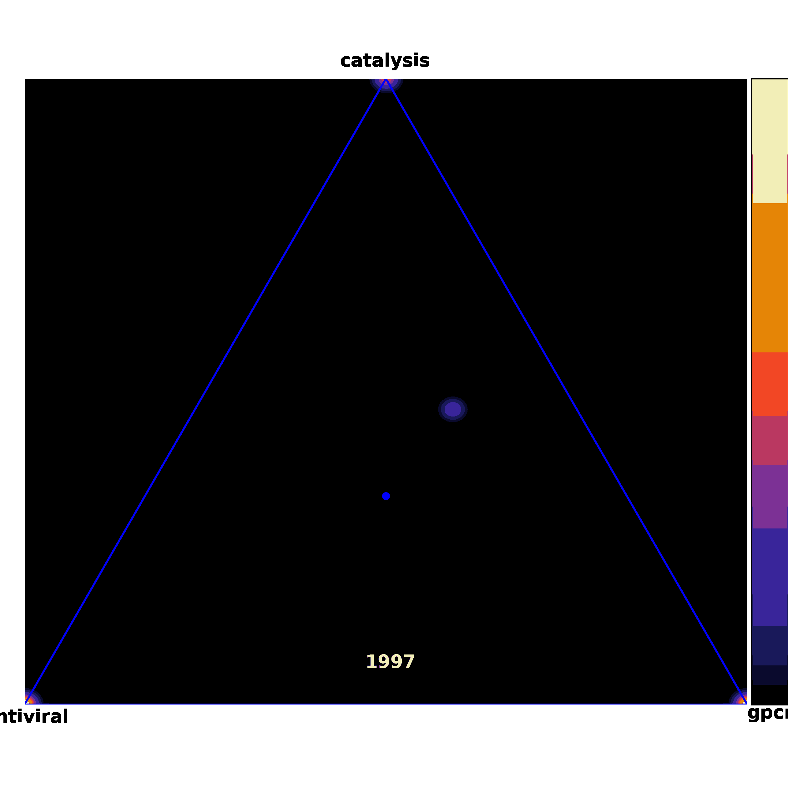

# Citation Network Project - UW-Madison Gellman Group Literature

Data source - Web Of Science CORE dataset

**Citation network spanning 1998-2003 starting from 'Foldamers: a Manifesto' by Samuel H Gellman (1998)**

Traversing this network was accomplished by traverse_final. The literature dataset I had access to exclusively contained reference information. The script I wrote to convert to citation data is detailed in converting_reference_files_to_citation_dict. This process was complicated significantly by limited memory. Each CORE file was  converted to a large edge list of citations by reversing the direction of each pointer. I used dask dataframes to make sorting these large edge lists more efficent. Lastly, I loaded chunks of the edge list into memory from a csv and wrote the contents to the corresponding citation json file by year. 

With these citation json files I was able to traverse the citation network successfully. However, the size of the complete network grows so quickly that I wanted to include only a subset of the most cited papers for each paper. I was able to update my citation json files to include this number of citations with add_num_citations.

**Coauthorship Network for Authors of Foldamer Papers**

**Visualizing the change in topics studied in the Foldamer literature**

  

Using a Word2Vec model I was able to determine the average similarity of a paper to a set of topics. The model was trained with the entire WebOfScience dataset containing papers up to 2021. The title, headers, subjects, keywords, and abstract for each paper were used for training. 

